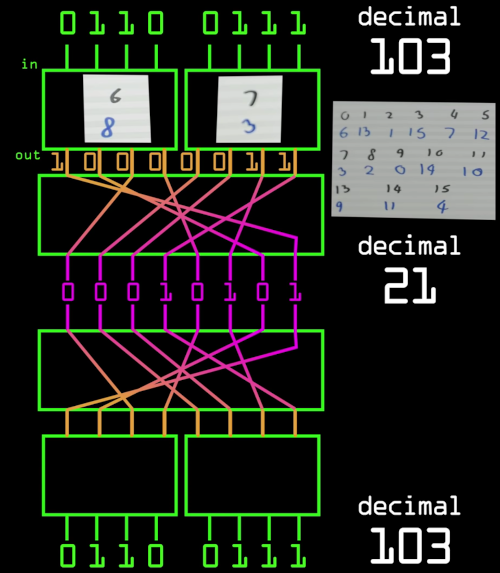

# SP Networks (basis of e.g. AES)
SP Networks are used by many encryption algorithms like AES (Advanced Encryption Standard). Its strenght depends on how many rounds are executed at encryption.

## Example
 
Source: Computerphile YouTube ([https://www.youtube.com/watch?v=DLjzI5dX8jc](https://www.youtube.com/watch?v=DLjzI5dX8jc))